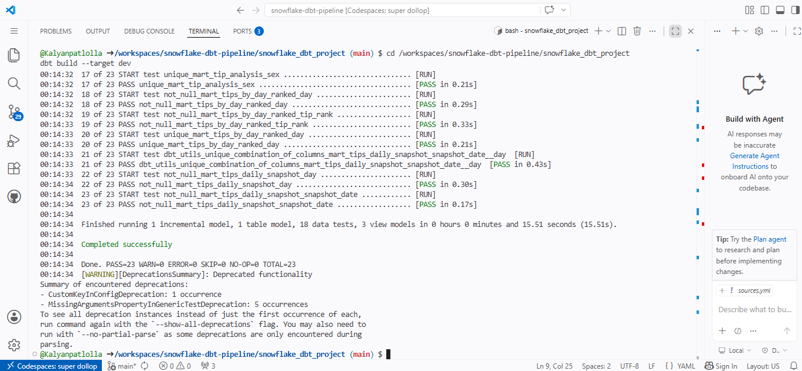
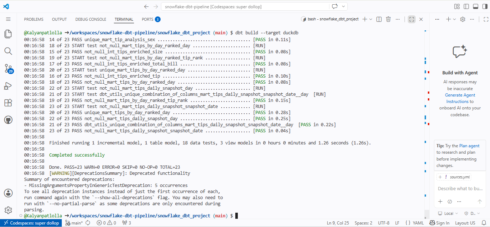
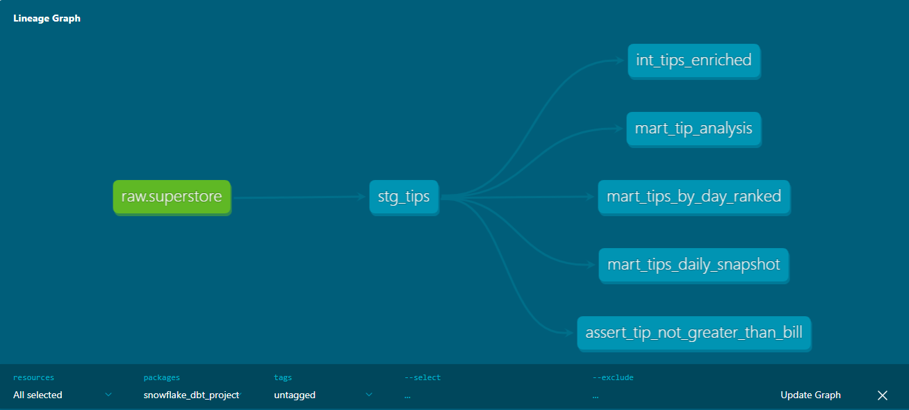
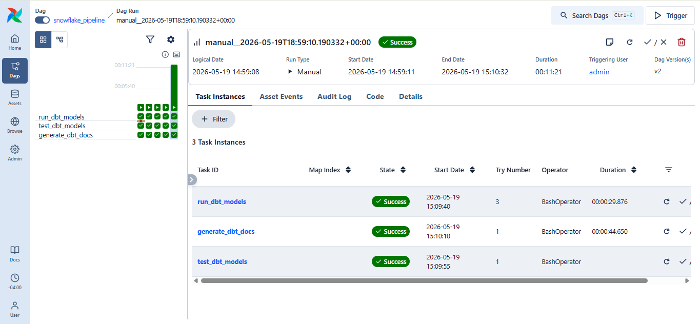
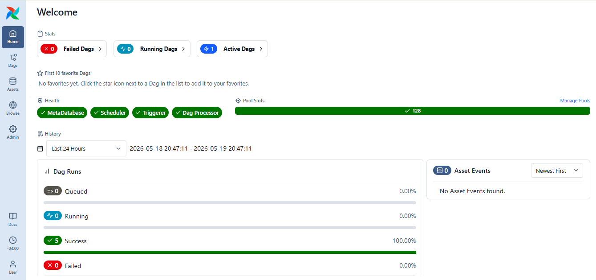
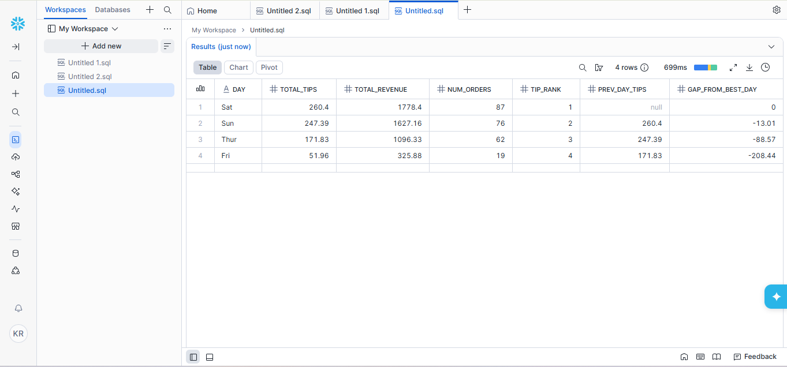

# 🦆❄️ Snowflake + dbt Warehouse-Agnostic Pipeline

[](https://github.com/Kalyanpatlolla/snowflake-dbt-pipeline/actions/workflows/dbt-ci.yml)

An analytics engineering project that loads raw data into **Snowflake**, transforms it with **dbt** (staging → intermediate → marts), tests it with **18+ data tests**, orchestrates with **Apache Airflow 3.x**, and **runs the exact same dbt code against DuckDB** — proving warehouse-agnostic design.

---

## 🎯 What This Project Demonstrates

| Skill | How |
|---|---|
| Modern dbt project structure | 5 models across staging / intermediate / marts layers |
| Warehouse portability | Same code runs on Snowflake AND DuckDB via Jinja conditionals |
| Window functions | RANK, LAG, MAX OVER in `mart_tips_by_day_ranked` |
| Incremental models | `mart_tips_daily_snapshot` processes only new rows |
| Data quality testing | 18 tests: not_null, unique, accepted_values, composite uniqueness, custom SQL |
| Orchestration | Airflow 3.x DAG runs dbt run → dbt test → dbt docs |
| Cloud development | All work in GitHub Codespaces — no local setup |

---

## 🏗️ Architecture

```text
                Raw CSV (244 rows)
                       |
            ___________|___________
           |                       |
load_to_snowflake.py    load_to_duckdb.py
           |                       |
           v                       v
      Snowflake                DuckDB (local)
    RAW.SUPERSTORE             raw.superstore
           |                       |
           |___ same dbt code ____|
                       |
                       v
            dbt transformations
                       |
              stg_tips (view)
                       |
          int_tips_enriched (view)
                       |
        _______________|_______________
       |               |               |
mart_tip_analysis  mart_tips_     mart_tips_daily
    (view)         by_day_ranked   _snapshot
                    (table)        (incremental)
                       ^
                       |
             Airflow 3.x DAG
            run → test → docs
```

---

## 🧱 Tech Stack

- **Snowflake** — cloud data warehouse (free trial, X-SMALL warehouse)
- **dbt-core 1.11** — SQL transformation framework
- **dbt-snowflake 1.11** + **dbt-duckdb 1.10** — both adapters installed
- **DuckDB 1.5** — embedded analytical database
- **Apache Airflow 3.0** — workflow orchestration
- **Python 3.12** — loaders and Airflow runtime
- **GitHub Codespaces** — cloud development environment
- **GitHub Actions** — CI on every push (auto-tests against DuckDB)

---

## 📊 The dbt Models

### Staging: `stg_tips`
- Materialized as **view**
- Reads from `raw.superstore` (CSV-loaded tips data)
- Cleans column names, adds `loaded_at` timestamp

### Intermediate: `int_tips_enriched`
- Materialized as **view**
- Single-source enrichment over staging

### Marts

**`mart_tip_analysis`** (view) — Tips aggregated by customer sex (avg tip, avg bill, count)

**`mart_tips_by_day_ranked`** (table) — Uses **window functions**:
- `RANK()` over total tips DESC
- `LAG()` to compare each day to the previous best
- `MAX() OVER ()` to compute gap from best day

**`mart_tips_daily_snapshot`** (incremental) — Captures daily aggregates. Only processes new rows via ``. Composite unique key: `(snapshot_date, day)`.

---

## ✅ Testing Strategy (18 tests)

| Test Type | Count | Example |
|---|---|---|
| `not_null` | 5 | `total_bill`, `tip` on `stg_tips` |
| `accepted_values` | 6 | `sex IN ('Male', 'Female')`, `day IN ('Thur', 'Fri', 'Sat', 'Sun')` |
| `unique` (single column) | 2 | `day` on ranked mart, `sex` on analysis mart |
| `dbt_utils.unique_combination_of_columns` | 1 | `(snapshot_date, day)` on incremental mart |
| Custom SQL test | 1 | `assert_tip_not_greater_than_bill.sql` |
| `not_null` on marts | 3 | Primary identifiers |

**23 build steps (5 models + 18 tests) pass on both Snowflake and DuckDB.**

---

## 🦆 Warehouse-Agnostic Design

The same dbt code runs on both warehouses. Differences are abstracted into `sources.yml`:

```yaml
sources:
  - name: raw
    database: "{{ 'SNOWFLAKE_DBT_DB' if target.type == 'snowflake' else 'duckdb_warehouse' }}"
    schema: "{{ 'RAW' if target.type == 'snowflake' else 'raw' }}"
    tables:
      - name: superstore
```

```bash
dbt build --target dev      # Snowflake
dbt build --target duckdb   # DuckDB
```

**One codebase, two warehouses, zero rewrites.**

---

## 📸 Proof It Works

### dbt build on Snowflake — 23 PASS, 0 ERROR


### dbt build on DuckDB — 23 PASS, 0 ERROR (in 1 second)


### dbt Model Lineage


### Airflow DAG — End-to-end orchestration


### Airflow Dashboard — 100% success rate


### Snowflake — Mart query results


---

## 🚀 How to Run

Everything runs in **GitHub Codespaces** — no local setup needed.

```bash
# 1. Install dependencies
pip install -r requirements.txt
cd snowflake_dbt_project
dbt deps

# 2. Load data
python loaders/load_to_snowflake.py    # Snowflake
python loaders/load_to_duckdb.py       # DuckDB

# 3. Run dbt
dbt build --target dev      # Snowflake
dbt build --target duckdb   # DuckDB

# 4. Run Airflow (optional)
nohup airflow standalone > ~/airflow/standalone.log 2>&1 &
```

---

## 🧠 Key Takeaways

- **The 3-layer pattern matters.** Staging cleans, intermediate joins, marts answer business questions.
- **`accepted_values` tests catch real bugs.** When DuckDB inferred `smoker` as BOOLEAN vs Snowflake's VARCHAR, this test surfaced the difference.
- **Incremental is not free.** The `unique_key` must actually be unique — fix was a composite key `(snapshot_date, day)`.
- **Jinja conditionals are the abstraction layer.** A single conditional in `sources.yml` made the whole project portable.
- **`dbt_utils` is essential** for tests beyond basics. Composite uniqueness alone justified the install.
- **Airflow 3.x renamed half its CLI.** `db init` → `db migrate`, `webserver` → `api-server`, `schedule_interval` → `schedule`.
- **Never hardcode secrets.** Use env vars + Codespaces Secrets from day one.

---

## ⚠️ Cost & Safety Notes

- Snowflake warehouse is **X-SMALL** (smallest tier)
- Always suspend after use: `ALTER WAREHOUSE COMPUTE_WH SUSPEND;`
- Dataset is small (244 rows) — entire `dbt build` uses negligible credits
- `profiles.yml` is in `.gitignore` — credentials never reach GitHub
- Snowflake credentials live in environment variables (Codespaces Secrets)

---

Built in GitHub Codespaces.